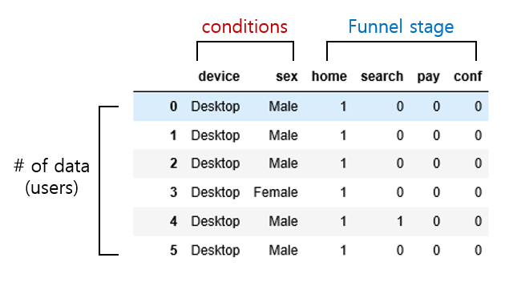
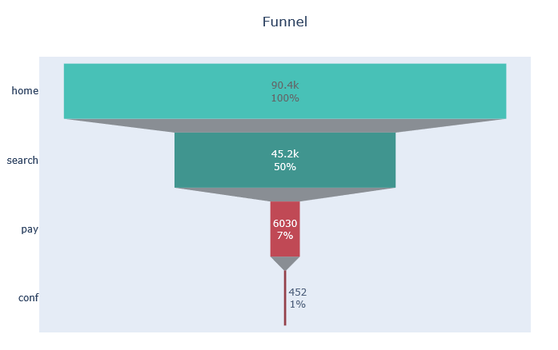
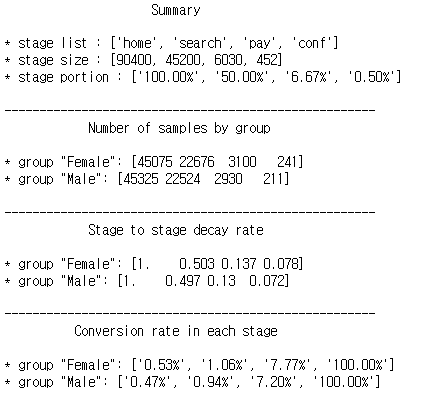
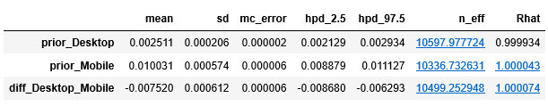
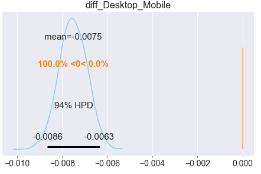

# tester 


simple module for A/B test.

**funnel_analysis.ipynb**


---

### 0. Up-comming updates

* revised updating 
* visualization function( comparing plot, etc)


### 1. Function (04/07/20)

* Conversion rate 
* Bayesian simulation ( A/B test )
* Funnel analysis  basic
*  plotting

* thompson sampling(MAB)
  * sample, update, status

### 2. Dependencies

* Scipy
* Pymc3
* arviz==0.6.0
* plotly
* pandas 
* numpy


### 3. Sample data-sets

source : https://www.kaggle.com/aerodinamicc/ecommerce-website-funnel-analysis#user_table.csv


---

### 4. Usage

#### 4.1 input structure : DataFrame



`Must be same like bellow.`

* data structure should be 'dataframe'
* two parts of data : 1) funnel stage,  2)conditions
  * funnel stage : binary elements(0 or 1) . it has value '1'  when a user achieve each stage, otherwise value '0'
  * conditions :  can be personal info of users or several versions you want to test

* no need to sort columns ordering . just distinguish each column where to put 'funnel stage' and 'conditions'
* each row is history of user


#### 4.2 basic - 'report'

##### 4.2.1 initialize

```python
ab = report(data, ['device','sex'])
```

at first, you should initialize the model. put the right dataframe structure first and 'conditions' columns after


##### 4.2.2 basic funnel plot

```python
ab.plot_funnel()
```



basic funnel plot


##### 4.2.3 ab test

```python
ab.conversion('home', 'conf', 'sex')
```


there are 3 arguments position.

first 2 arguments are 2 of 'funnel stage' and last argument is one of element in 'conditions'.  in the above example, 'home' is interest stage and 'conf' is your comparing stage. it just show you simple conversion rate of  **'conf' / 'home'** . it means almost 0.5% of 'Female' reach to 'conf' stage from 'home' stage and 0.04% of 'Male' reach to 'conf' stage from 'home' stage. 


##### 4.2.4 funnel summary

```python
ab.funnel('device')
```




##### 2.5 bayesian a/b simulation

```python
ab.absim('home', 'conf', 'sex')
```

```python
print(ab.summary)
```



*output is same exactly with pymc.summary


```python
ab.plot_posterior(ab.trace, 'diff_Desktop_Mobile')
```



*output is same exactly with arviz plot


#### 4.3 basic - 'mab'

* sample

* update

* status