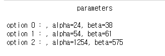

# ab_tester (version Beta)


simple module for A/B test.

**ab_tester.py**


---

### 0. Up-comming updates

* live updating function based on 'thompson' sampling
* visualization function( comparing plot, etc)


### 1. Function (04/05/20)

* Conversion rate 
* Bayesian simulation ( A/B test )
* Funnel analysis  basic
*  plotting


### 2. Dependencies

* Scipy
* Pymc3
* arviz==0.6.0
* plotly
* pandas 
* numpy


### 3. Sample data-sets

source : https://www.kaggle.com/aerodinamicc/ecommerce-website-funnel-analysis#user_table.csv


---

### 4. Usage

#### 4.1 input structure : DataFrame


`Must be same like bellow.`

* data structure should be 'dataframe'
* two parts of data : 1) funnel stage,  2)conditions
  * funnel stage : binary elements(0 or 1) . it has value '1'  when a user achieve each stage, otherwise value '0'
  * conditions :  can be personal info of users or several versions you want to test

* no need to sort columns ordering . just distinguish each column where to put 'funnel stage' and 'conditions'
* each row is history of user


#### 4.2 basic 

##### 4.2.1 initialize

```python
ab = ab_tester(data, ['device','sex'])
```

at first, you should initialize the model. put the right dataframe structure first and 'conditions' columns after


##### 4.2.2 basic funnel plot

```python
ab.plot_funnel()
```


##### 4.2.3 ab test

```python
ab.abtest(initial, target, condition)
```


```python
ab.beta(initial, target, condition)
```


```python
print(ab.index)
print(ab.alpha)
print(ab.beta)
```




##### 4.2.4 funnel summary

```python
ab.funnel('device')
```


##### 2.5 bayesian a/b simulation

```
ab.absim(initial, target, condition)
```

```python
print(ab.summary)
```


*output is same exactly with pymc.summary


```python
ab.plot_posterior(ab.trace, 'diff_Desktop_Mobile')
```


*output is same exactly with arviz plot